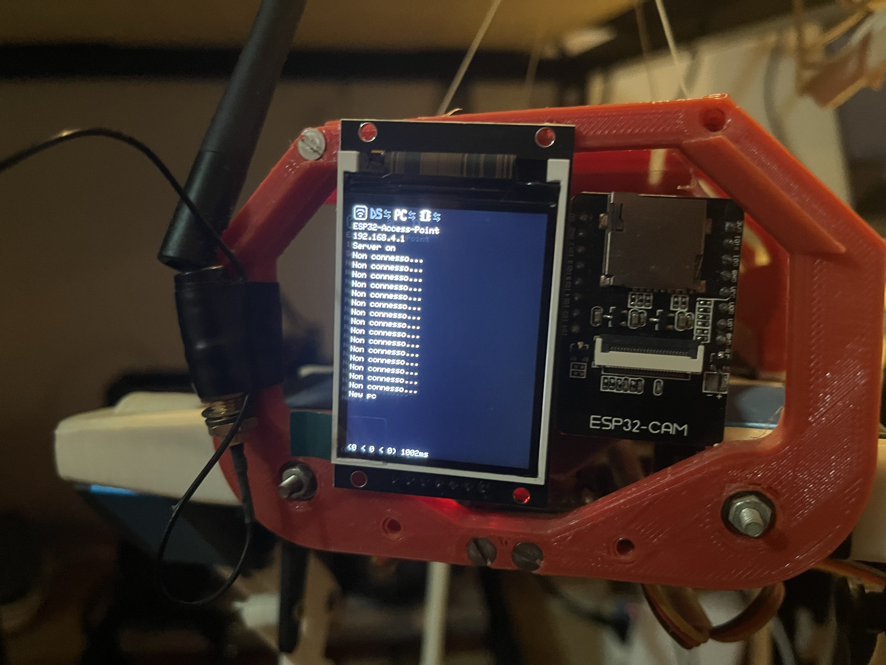
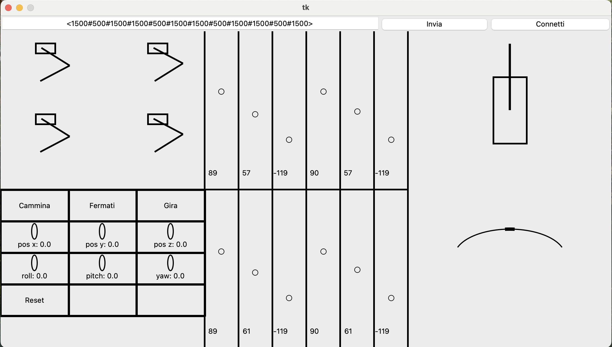
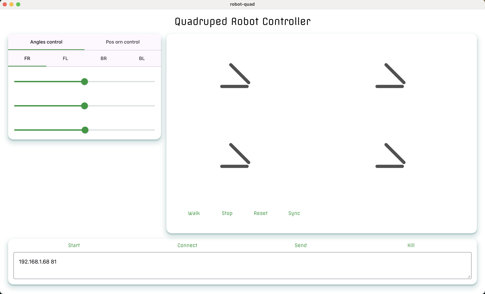
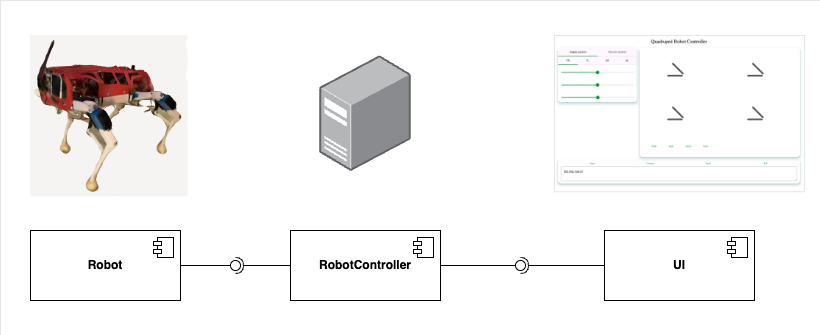
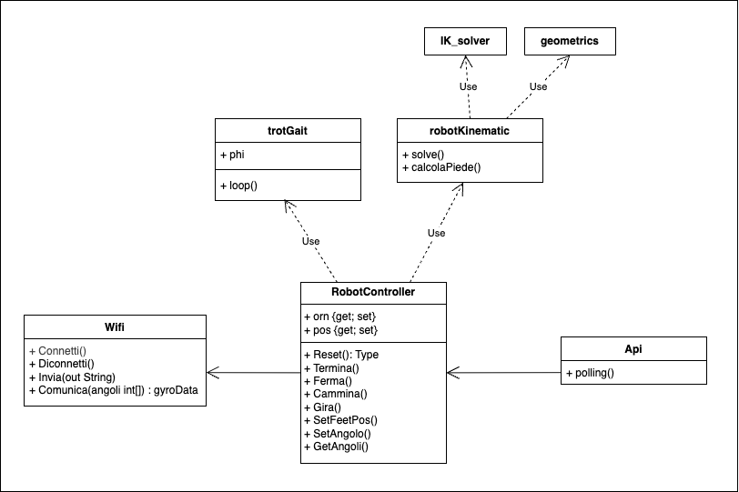

# Welcome

This repository contains a simple program to control a 12 dof robot dog

## The robot

A lot of years ago i built a 3d printed quadruped robot following this project:

https://hackaday.io/project/171456-diy-hobby-servos-quadruped-robot

Due to limited budget i decided to replace the raspberry pi with a cheaper AVR microcontroller to move motors and an ESP32 to communicate with the computer for the value to set on each joint.

The ESP32 in on the front on the robot and communicate via UART protocol with the AVR chip inside on another board connected with all 12 motor.

On the ESP32 board I mounted a display that shows commands frequency, commands data and connection state. 
There is also the support for a camera that I planned to add and in another project I have coded the necessary to capture a photo and send it via tcp stream at a decent rate on the same board of the robot.

A thing to be added is the gyro sensor, in the past I have mounted it on the robot but during the years I don't know why it has been removed preserving the board pins header and some code.

## The program

For the following task i used code from the robot project linked before:

- calculate all 12 joints values from coordinates body-to-feet of each feet
- update feets position to make robot moves by specific speed, direction, self-rotation, step-time and step-plan.

At first my goal was to make a graphic interface for me to use the robot project's code with my setup, so i created a python tkinter interface.

Years later, to explore further some topics during my university studies, I updated the GUI using electron framework and some google's web components.

I implemented the following features:

- angle set for each of the twelve robot's joints
- control of a single feet by grabbing it in the view
- set robot's roll, yaw and pitch
- set robot's position from feets
- set walking direction and walk
- set turning direction and speed and turn
- manual send messages to the robot

All these features work fine and they are well integrated, for example moving by angles does not reset the movement made by using coordinates and vice versa, but some are missing in the new GUI.

Ho inserito questo diagramma perchè il robot, la logica di controllo e la parte di interfaccia utente sono divisi.
Il robot imposta gli angoli dei motori che riceve tramite TCP.
La logica di controllo è un processo python che mette a disposizione le operazioni per il calcolo degli angoli da inviare al robot.
La parte di presentazione è un programma node che fornisce all'utente un'interfaccia grafica con cui chiamare le operazioni.

I added this diagram because the robot, control logic, and user interface are separated:
- The robot sets the motor angles it receives via TCP. 
- The control logic is a Python process that provides operations for calculating the angles for the robot. 
- The presentation part is a Node.js program that provides a graphical interface to invoke control operations.

This diagram shows the python code structure:

