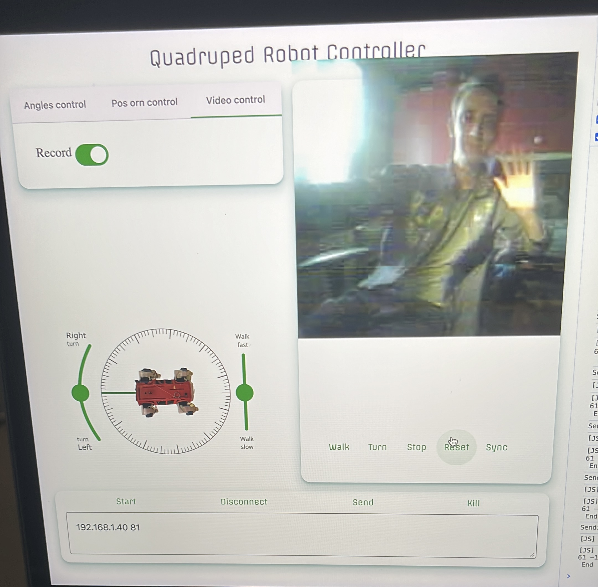

# Welcome

This repository contains a program to control a 12 dof robot dog

## The robot

A lot of years ago I built a 3d printed quadruped robot following this project:

https://hackaday.io/project/171456-diy-hobby-servos-quadruped-robot

Due to limited budget I decided to replace the raspberry pi with a cheaper AVR microcontroller to move motors and an ESP32 to communicate with the computer for the value to set on each joint.

The ESP32 is on the front on the robot and communicate via UART protocol with the AVR chip inside on another board connected with all 12 motor.

On the ESP32 board I mounted a display that shows commands frequency, commands data and connection state.

A thing to be added is the gyro sensor, in the past I have mounted it on the robot but during the years I don't remeber why I removed it preserving the board pins header and some code.

## The program

For the following tasks I used code from the robot project linked before:

- calculate all 12 joints values from coordinates body-to-feet of each feet
- update feets position to make robot moves by specific speed, direction, self-rotation, step-time and step-plan.

At first my goal was to make a graphic interface for me to use the robot project's code with my setup, so I created a python tkinter interface.

Years later, to explore further some topics during my university studies, I updated the GUI using electron framework and some google's web components.

I implemented the following features:

- angle set for each of the twelve robot's joints
- control of a single feet by grabbing it in the view
- set robot's roll, yaw and pitch
- set robot's position from feets
- set walking direction 
- walk
- set turning direction and speed
- turn
- live video stream

All these features works fine and they are well integrated, for example moving by angles does not reset the movement made by using coordinates and vice versa.

Control logic, and user interface are separated:
- a python program calculates everything
- a web interface allow the user to send commands, view robot movements and camera stream

I added the below diagrams in the attempt to explain better the struture.
- The robot sets the motor angles it receives via TCP. 
- The control logic is a Python process that provides operations for calculating the angles for the robot. 
- The presentation part is a Node.js program that provides a graphical interface to invoke control operations.

This diagram shows the python code structure:

P.S. I have added unit tests for python wifi class to test capabilities of AI. I haven't considered testing during my development because I discovered their powerfull and need too late. Maybe in future I can add a useful test suite for all project.
P.S. Feel free to contact me for every kind of information or technical request

## setup

**Requirements:** node and python

from the root folder follow this steps:

- start the setup script (for more info look inside the file)

    > chmod +x setup.bash

    > ./setup.bash

- check if everything works

    > npm start
    

## LICENSE and THIRD PARTS NOTICE

see NOTICE file